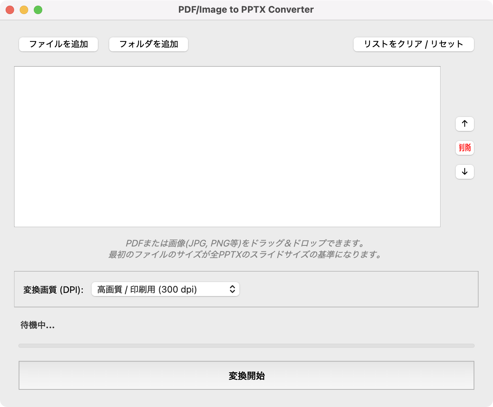

# PDF to PPTX Converter

PDFを画像化し、PowerPointファイルに変換するツールです。MacとWindowsの両方で動作します。

## 1. 前提条件 (重要: Popplerのインストール)

このツールはPDFを画像に変換するために poppler というライブラリのシステムへのインストールが必要です。Pythonライブラリだけでは動作しません。

### Mac (macOS) の場合

Homebrewを使ってインストールするのが最も簡単です。ターミナルで以下を実行してください。
```
brew install poppler
```

### Windows の場合

1. Poppler for Windows から最新のReleaseをダウンロードします（例: Release-X.XX.X-0 のzipファイル）。

2. ダウンロードしたzipを解凍します。

3. 解凍したフォルダの中にある bin フォルダ（例: C:\Program Files\poppler-0.68.0\bin）のパスをコピーします。

4. Windowsの「システム環境変数の編集」を開き、ユーザー環境変数の Path に、コピーした bin フォルダのパスを追加します。

5. PCを再起動またはログアウトして反映させます。

## 2. インストール

プロジェクトのフォルダでターミナル（またはコマンドプロンプト）を開き、以下のコマンドでPythonライブラリをインストールします。

```
pip3 install -r requirements.txt
```

## 3. 実行方法

以下のコマンドでアプリを起動します。

```
python3 pdf_to_pptx_converter.py
```

## 4. 実行ファイル化 (配布用)

他のPCでPythonなしで動かしたい場合は、PyInstallerを使ってアプリ化できます。

PyInstallerをインストール:

```
pip3 install pyinstaller
```

ビルド実行:

### Macの場合
```
python3 -m PyInstaller --noconsole --onefile --windowed --icon="Gemini_Generated_Image_xbcj15xbcj15xbcj.png" --name="PDF2PPT" pdf_to_pptx_converter.py
```

### Windowsの場合
```
python3 -m PyInstaller --noconsole --onefile --icon="Gemini_Generated_Image_xbcj15xbcj15xbcj.png" --name="PDF2PPT" pdf_to_pptx_converter.py
```


dist フォルダの中に実行ファイル（Macなら .app、Windowsなら .exe）が生成されます。